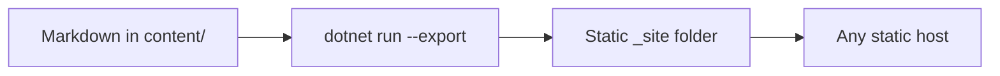

We'll walk you through your first deployment.

Teatime is built to be simple: you write in Markdown, and the server handles the rest. There is no database configuration or complex deployment process to manage.

Please follow our [Installation](/deploy/install/) or [Docker](/deploy/containers/) guide before starting.

Follow these steps to manage your content.

## 1. Create a Post

To start writing, create a new `.md` file inside your `content/posts/` folder.

Every file needs a block of settings at the top, called [front matter](/examples/frontmatter/). This tells the server how to display your post. Use this template to begin:

```md [content/posts/hello.md]
---
title: A Quiet Introduction
date: 2026-07-15
tags: [meta, writing]
summary: The first note on a blog that is just a folder of Markdown.
cover: /assets/hello.webp
---

Your words begin here.
```

Only `title` and `date` are needed. Everything else is optional, and sensible defaults fill in the rest.

| Field     | What it does                                             |
| --------- | ------------------------------------------------------- |
| `title`   | The heading and browser tab text                        |
| `date`    | The primary sort key, so newer posts rise to the top    |
| `tags`    | Grouped into tag pages and the tag index                |
| `draft`   | Set to `true` to keep a post out of listings and feeds  |
| `slug`    | A URL override, otherwise the filename is used          |
| `summary` | An excerpt override for cards, feeds, and social previews |

Those are the fields you reach for every day. The full set, including the ones that tune metadata and standalone pages, lives in the [front matter reference](/examples/frontmatter/).

Before you publish, a quick checklist can help:

- [x] A `title` and a `date` are set
- [x] Any images live under `content/assets/`
- [ ] A final read for typos and tone
- [ ] `draft: true` removed when you are happy

## 2. Preview Locally

Because Teatime reads content in memory, your changes appear the moment you save. Pick whichever run command fits your habit:

::: code-group

```bash [watch]
dotnet watch --project src/Teatime
```

```bash [run]
dotnet run --project src/Teatime
```

:::

Your site is then available at `http://localhost:5000`, and edits under `content/` refresh on their own.

::: tip
A post marked `draft: true` still shows while you develop, yet it stays out of listings, feeds, and the sitemap once you publish. That gives you a private preview with no extra tooling.
:::

## 3. Publish Your Site

When a post is ready, export the whole blog as static HTML. One command crawls every page, post, tag, archive, and feed, then writes plain files any host can serve.

```bash [Export]
dotnet run --project src/Teatime -- --export ./_site --base-url https://example.com
```

The `--base-url` value is woven into your feed, sitemap, and social tags, so it is worth setting to your real domain. If your blog lives in a subdirectory, add a base path so every internal link resolves correctly:

```bash {2} [Subdirectory export]
dotnet run --project src/Teatime -- --export ./_site \
  --base-url https://example.com/blog --base-path /blog
```

The `_site` folder is fully self-contained. The whole flow looks like this:



## 4. Deploy Anywhere

A static export travels well, so you have several good homes for it:

::: code-group

```bash [GitHub Pages]
# Push the _site folder to a gh-pages branch
git subtree push --prefix _site origin gh-pages
```

```bash [Netlify]
# Build command:  dotnet run --project src/Teatim -- --export ./_site --base-url $URL
# Publish dir:    _site
```

```bash [rsync]
# Copy the folder to your own server
rsync -av --delete _site/ user@host:/var/www/blog/
```

:::

If you would rather run Teatime as a live service, a container is a comfortable fit. We suggest to take a look at our [running Teatime with Docker](/deploy/containers/) page.

## 5. Format Your Writing

Since your posts are Markdown, Teatime gives you more than the basics. Callout containers read a little softer than a plain quote, and they come in several tones:

::: note
A note container suits context you would like readers to notice without alarm.
:::

::: warning
A warning container fits the rare moment when a detail could really trip someone up.
:::

::: danger
A danger container is reserved for the few cases where a mistake is costly.
:::

You can fold a longer aside behind a summary to keep the page scannable:

::: details A longer aside, folded away
Content inside a `details` container stays hidden until a reader opens it, which keeps supporting detail close by without crowding the main thread.
:::

Small inline labels help with versions or status <Badge type="tip">v1.0+</Badge>. Code blocks can carry a title, highlight a line, and number their lines:

```csharp:line-numbers {3} [Program.cs]
var builder = WebApplication.CreateBuilder(args);
var app = builder.Build();
app.MapGet("/", () => "Hello from Teatime"); // this line is highlighted
app.Run();
```

Images can carry a caption and choose their width. The alt text becomes a caption below the image, and a few attributes set the size:

```md

```

- `{.natural}` keeps the original size, and `{.plain}` drops the frame
- `{.left}` and `{.right}` float the image beside your text
- `{.wide}` reaches a little past the reading column, and
- `{.full}` spans the whole viewport

For a row of images side by side, wrap them in a [gallery](/examples/gallery/) (you can find an example [here](/examples/gallery/)).

```md
::: gallery


:::
```

The post cover set in [front matter](/examples/frontmatter/) accepts the same width attributes, so a full-bleed hero is one line: `cover: /assets/hero.webp {.full}`.

Definition lists keep paired ideas tidy:

Static export
:   A folder of plain HTML you can host anywhere.

Live server
:   The running app that reads your Markdown and renders it on request.

And when a thought needs a source, a footnote tucks it out of the way.[^1] 

External links can open in a new tab with a small attribute as standardized in [the Markdig reference](https://github.com/xoofx/markdig){target="_blank" rel="noopener"} with `{target="_blank" rel="noopener"}`.

[^1]: Footnotes render at the bottom of the page with a link back to where you were reading.

That's all. Happy publishing!
