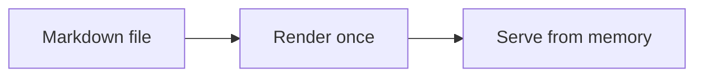

Below is just about everything you will need to style in a Teatime post. If it looks right here, it looks right everywhere, so it is a handy page to keep around. Check the source to see how each piece is written.

## Headings

Six levels exist, but a post rarely needs more than three. Use them to describe the shape of the page, not to resize text.

### A third-level heading

#### A fourth-level heading

A paragraph should carry its weight. It can hold a [link](https://github.com/melosso/teatime), a run of **bold** and *italic*, a ~~struck~~ correction, a bit of `inline code`, a footnote,[^note] and even x^2^ or H~2~O without losing the plot.

## Media

Images sit in a figure and borrow their caption from the alt text, so a screenshot always arrives with a label.


## Video

Video's can be easily embedded.


## Lists

A definition list pairs a term with its meaning:

Post
: A Markdown file under `content/posts/` with a date in its front matter.

Draft
: A post that stays out of listings and feeds until you are ready.

An ordered list carries a sequence:

1. Write the file
2. Save it
3. Watch the post appear

An unordered list gathers points that share no order:

- Markdown in, HTML out
- No database, no build step
- Files you can still read in ten years

A task list tracks what is left:

- [x] Draft the post
- [x] Read it aloud
- [ ] Publish

## Table

| Surface | Route            | Sorted by |
| ------- | ---------------- | --------- |
| Home    | `/`              | Newest    |
| Post    | `/posts/{slug}`  | Date      |
| Archive | `/archive`       | Year      |

## Code

Inline code, like `dotnet run`, sits inside a sentence. A fenced block keeps its shape and gets highlighted:

```csharp
public static string Greet(string name) => $"Hello, {name}";
```

## Blockquote

> I am putting myself to the fullest possible use, which is all I think that any conscious entity can ever hope to do.

## Callout

::: tip
Reach for a callout when a single aside should not be missed. Use them sparingly, or they stop meaning anything.
:::

## Math

An inline formula such as $E = mc^2$ reads within the line. A display block stands on its own:

$$
\int_0^1 x^2 \, dx = \frac{1}{3}
$$

## Diagram



## Cards

Drop a link on its own line and Teatime turns it into a card, with the title, description, and site icon pulled from the page itself:

https://fosstodon.org/@example

A link written [inline](https://fosstodon.org/@example), or one with its own label, stays an ordinary link. Only a bare URL alone on a line becomes a card.

[^note]: A footnote lands down here, linked both ways so a reader never loses their place.
